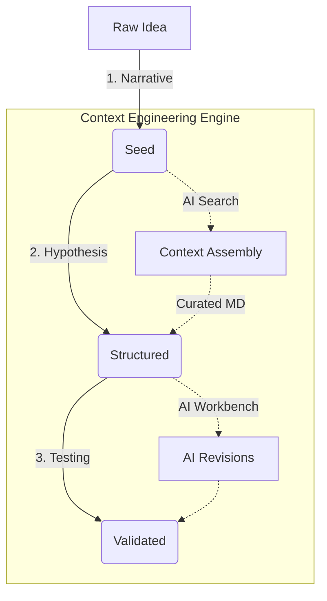

# Primer: Engineering Global Transparency and Civic Consensus

> **"Strong and Peer-Reviewed Ideas through Engineered Context."**

Primer is a context-engineering architecture designed to transform raw ideas into high-fidelity, structured, and machine-interpretable artifacts called **Sparks**. By treating context as a first-class, version-controlled engineering asset, Primer enables a "Modular Meritocracy" where ideas are refined, audited, and validated through an agentic workflow.

---

## 💎 The Philosophy: Context as Code

In traditional LLM interactions, context is ephemeral and often unstructured. Primer replaces this with **Engineered Context**:

1.  **Pure Markdown Persistence**: Ideas are formalized into `.spark.md` files with a streamlined 3-section core. No YAML frontmatter required.
2.  **Core Maturity**: A Spark moves from `seed` to `validated` by fulfilling the requirements of Narrative, Hypothesis, and Testing modules.
3.  **H1-Identity**: The canonical name of every Spark is derived from the first `# Heading` in the file.

---

## ⚖️ Governance & Public Transparency

Primer is uniquely positioned for **Governments, Councils, and Public Institutions** where transparency and accountability are non-negotiable.

- **Auditable Decision Traces**: Every transition in a Spark's maturity (from `Seed` to `Validated`) is preserved with linked evidence, AI audits, and peer critiques.
- **Proof of Reasoning**: By formalizing hypotheses and documenting evaluation results, Primer provides a "Glass Box" view into how complex public policy or infrastructure decisions were reached.
- **Citizen Participation & Science**: Enables inclusive **Public Consultation**. Civic stakeholders can audit the reasoning, provide peer-level critiques, and participate in the development of ideas in real-time.
- **Institutional Trust**: The structured `.spark.md` format ensures that the context behind high-stakes decisions is never lost, fragmented, or obscured.

---

---

## 🌎 Scalable Global Participation

Primer’s context-engineering architecture is designed to scale **Collaborative Discovery** across the entire planet:

*   **Planetary (Global)**: Coordination on humanity-scale Sparks (e.g., climate action, global health).
*   **Specialized (Domain)**: Deep-dive technical or policy collaboration on research-heavy Sparks.

### The Pure Markdown Workflow

1.  **Intuitive Drafting**: Start with a Compelling Narrative (Section 1).
2.  **Logical Formalization**: Reduce the narrative to a falsifiable Hypothesis (Section 2).
3.  **Empirical Testing**: Document outcomes and simulation Results (Section 3).

---

## 📈 The Lifecycle: From Seed to Validated

The transformation of a raw idea into a **Validated Spark** follows a structured blueprint:



Primer provides the infrastructure to navigate this lifecycle with rigor, ensuring that every transition is backed by evidence and peer/agentic audit.

---

## ⚡ Core Artifact: The Spark (`.spark.md`)

A **Spark** is the primary unit of work in Primer. It is a structured Markdown document that bridges human-readable narrative with machine-consumable technical sections.

### The 3-Section Core Model
1.  **Spark Narrative**: The qualitative core and Compelling Story.
2.  **Hypothesis Formalization**: Falsifiable statement and Null Hypothesis.
3.  **Testing & Results**: Technical methodologies and empirical outcomes.

---

## 🏗️ Architecture Overview

Primer operates through a coordinated layer of agents, tools, and models:

-   **Agent Orchestrator**: The entry point that manages tasks and selects prompt templates.
-   **Model Gateway**: Abstracts LLM backends (Claude, Gemini, etc.) and enforces context window constraints via intelligent truncation/summarization.
-   **RAG (Spark Service)**: Curates and normalizes data from tools into the Spark's technical sections.
-   **Tool Adapter (MCP)**: Leverages the Model Context Protocol to ground ideas in real-world codebases, metrics, and documentation.

---

## 🧪 Project Structure

-   [**`/docs/`**](file:///home/vishravars/code/primer/docs): Deep-dive into the [Context Engineering System Design](file:///home/vishravars/code/primer/docs/context-engineering-system.md).
-   [**`/spark-assembly-lab/`**](file:///home/vishravars/code/primer/spark-assembly-lab): The "AI Workbench" UI. A React-based interface for drafting, searching, and auditing Sparks.

---

## 🚀 Getting Started

To launch the **Spark Assembly Lab** workbench locally:

```bash
cd spark-assembly-lab
docker compose up
```

Visit `http://localhost:3000` to start engineering your first Spark.

---

> *"Execution is the Moat. Build with clarity. Validate with rigor."*